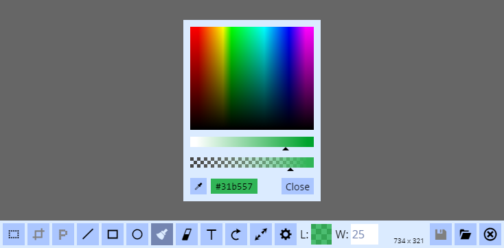

Painterro is singlefile JavaScript paint component which allows to edit images directly in browser.
It can be easily integrated into your website or blog by including only one `painterro.js` file and calling init code.

With Painterro you can:
- Paste image from clipboard (for example screenshot)
- Crop image by defined area
- Paint lines and rectangles (alpha color can be used)
- Add text



Example usecase: You make screenshot by pressing `PrtSc` button, then open Painterro on your website, paste image, 
crop it to interested area then highlight something with line/rectangle tool and/or add some text 
to the image.

Painterro is written with vanilla JS, without any additional frameworks to stay lightweight and nimble. Code 
written on ES6 which transplited by Babel and packed using webpack.

# Supported hotkeys

|||
|-|-|
| `Ctrl + Z` | Cancel last operation |
| `Ctrl + V` | Paste image from clipboard (replace all that drawn) |
| `Shift` when drawing **rect**/**ellipse** | Draw **square**/**circle** |
| `Shift` when drawing **line** | draw at angles of `0`, `45`, `90`, `135` etc degrees | 
| `Alt` when using pipette | Open zoom helper |
| `Ctrl` + `Wheel mouse up/down` | Zoom image to 100% and back. Works only if image doesn't fit in the draw area (e.g. area `600x600` and you draw image `1920x1080`) |


# Configuration

| Param | Description | Default |
|-|-|-|
| `id` | If provided, then Painterro will be placed to some holder on page with this `id`, instead of autoholder | undefined |
|`activeColor`| Line/Text color that selected by default | '#ff0000' |
|`activeColorAlpha` | Transparancy of `activeColor` from 0.0 to 1.0, 0.0 = transparent | 1 |
|`activeFillColor` | Fill color that selected by default | '#000000' |
|`activeFillColorAlpha` | Transparancy of `activeColor` from 0.0 to 1.0 | 0 |
|`defaultLineWidth` | Line width in `px` that selected by default | 5 |
|`backgroundFillColor` | Default background color when image created/erased | "#ffffff" |
|`defaultFontSize` | Default font size in pixels | 24 |
### UI color scheme (`colorScheme` group)
Next group of params used to configure painterro user interface. 
They should be placed under `colorScheme` group (see example below)

| Param | Description | Default |
|-|-|-|
|`main` | Color of panels, take most of UI space | '#dbebff' |
|`control` | Color of controls background (e.g. button background) | "#abc6ff" |
|`controlContent` | Content of controls (e.g. button text) | '#000000' |
|`activeControl` | Color for control when it active (e.g. button pressed) | '#7485B1' |
|`activeControlContent` | Color for activated control content | `main` |
|`inputBorderColor` | You can add border to inputs, by default color is same as `main` so borders will not be seen | `main` |
|`inputBackground` | Background of inputs | '#ffffff' |
|`inputText` | Color of text in input | `activeControl` |
|`backgroundColor`| Background color of component area which left outside of image due to it size/ratio | '#999999' |
|`dragOverBarColor`| Color of bar when dropping file to painterro | '#899dff' |

### Example

```js
Painterro({
    // you should provide your save handler, which will post/update image on server:
    saveHandler: function (image, done) {
      // of course, instead of raw XHR you may use fetch, jQuery, etc
      var xhr = new XMLHttpRequest(); 
      xhr.open("POST", "http://127.0.0.1:5000/save-as-base64/");
      xhr.setRequestHeader("Content-Type", "application/json");
      xhr.send(JSON.stringify({
        image: image.asDataURL('image/png')
      }));
      xhr.onload = function (e) {
        // after saving done, call done!
        done(true); //done(true) will hide painterro, done(false) will leave opened
      }
    },
    activeColor: '#00b400',  // change active color to green
    colorScheme: {
      main: '#fdf6b8' // make panels light-yellow
    }
}).show();
```
You can see backend part for this example that will receive and save file on server in `example/server.py` directory. 
Example written on python3 using `Flask`, but it can be implemented using any technology. Saving done in `def saver()` method.

# Development

After pulling repo install node modules:
```bash
cd painterro
npm install
```

### Building painterro

```bash
npm run build
```
Result file is `build/painterro.js`

### Dev-server
To start hot-reload dev server for reloading code "on the fly":
```bash
npm run dev
```
Then open http://localhost:8080 with demo page

### Regenerating icons font

Add/edit icons in `res` folder. Then run
```bash
npm run buildfont
```

# ToDo list

- Edit button on images (provide selector)
- Add color pallete